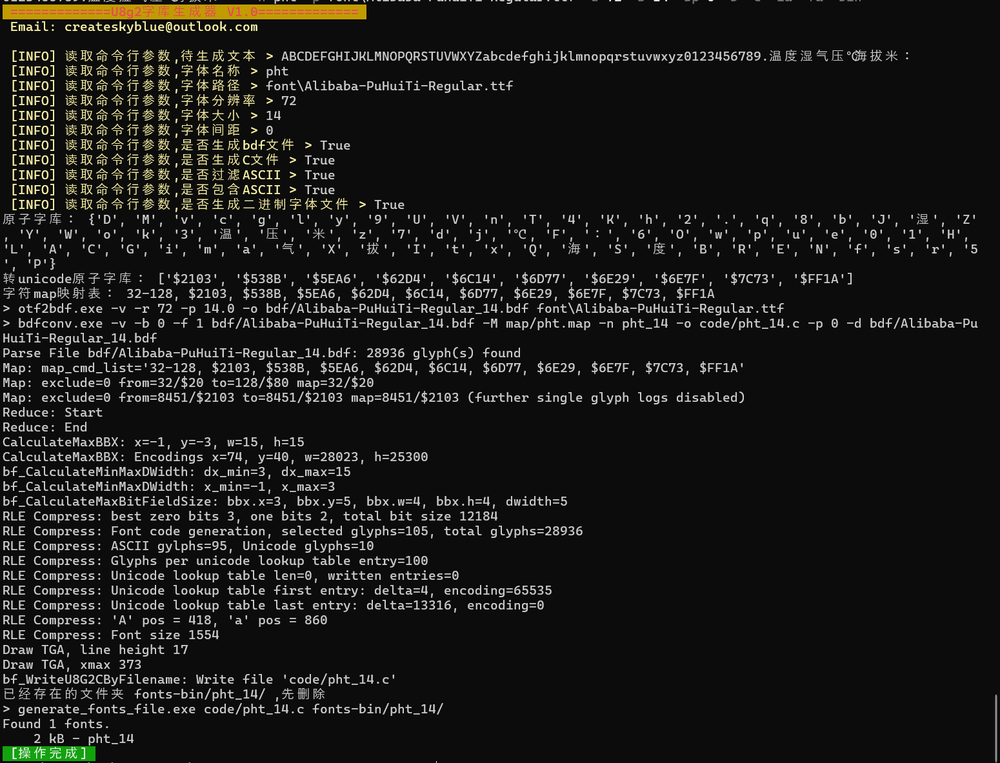

# U8g2字体生成工具

fork自<https://github.com/createskyblue/Easy-u8g2-font-generate-tools>
增加了通过C语言字库文件生成u8g2二级制字体的功能，支持嵌入式rust中u8g2的，此工具来自https://github.com/Finomnis/u8g2-fonts/tree/main/tools/generate_fonts_file，只是集成在main.py中，可通过一个命令完成所有的字体创建。
方便Arduino、C、Rust嵌入式开发中自定义u8g2字体的使用。

这是一个易于操作的U8g2字体生成工具，使用者只需要输入需要转换的文本，选择字体文件以及设置字体大小，该工具会自动对文本进行去重、生成map字体映射文件、生成bdf字库并最终导出C语言字库代码

## 开源协议

main.py适用于GPL3.0协议

## 实现功能

- [x] 自定义文本
- [x] 文本自动去重
- [x] ASCII字符可选
- [x] 自定义ttf字体
- [x] 自定义字体大小
- [x] 字间距调整
- [x] 生成C语言字库文件
- [x] 生成Rust语言二进制字库文件

## 使用方式

### 交互式方式：

> python3 main.py 

### 命令方式：

> python main.py -i ABCDEFGHIJKLMNOPQRSTUVWXYZabcdefghijklmnopqrstuvwxyz0123456789.温度湿气压℃海拔米：  -n pht -p font\Alibaba-PuHuiTi-Regular.ttf -d 72 -s 14 -sp 0 -b -c -ia -fa -bin

## 第三方工具使用

| 名称                     | 来源                                                                         |
|:----------------------:|:--------------------------------------------------------------------------:|
| bdfconv                | <https://github.com/olikraus/u8g2>                                         |
| otf2bdf                | <http://sofia.nmsu.edu/~mleisher/Software/otf2bdf/>                        |
| Alibaba-PuHuiTi-Medium | <https://ics.alibaba.com/project/Hn8mXx>                                   |
| Rust字体文件转换工具           | https://github.com/Finomnis/u8g2-fonts/tree/main/tools/generate_fonts_file |

## 演示图片

